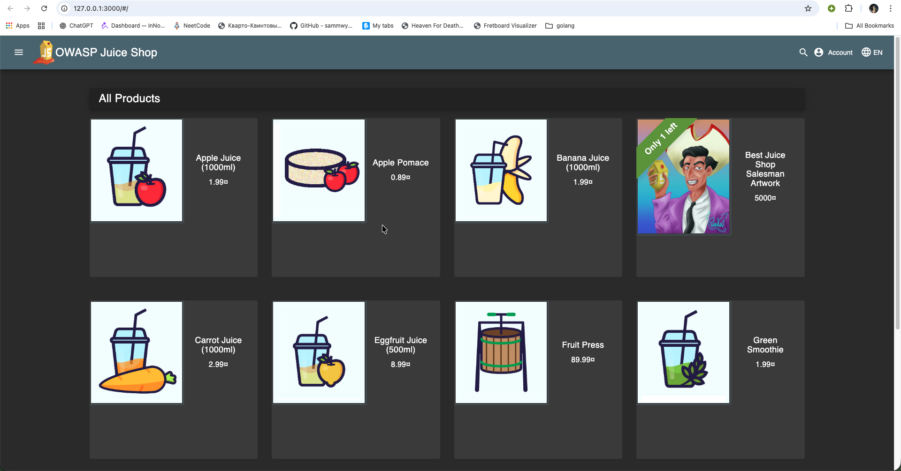
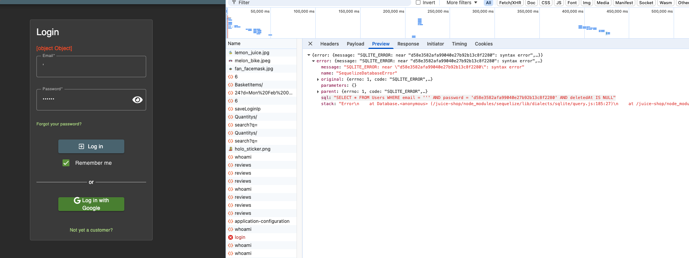

# Triage Report — OWASP Juice Shop

## Scope & Asset
- Asset: OWASP Juice Shop (local lab instance)
- Image: bkimminich/juice-shop:v19.0.0
- Release link/date: [link](https://hub.docker.com/layers/bkimminich/juice-shop/v19.0.0/images/sha256-547bd3fef4a6d7e25e131da68f454e6dc4a59d281f8793df6853e6796c9bbf58) — 4 sept 2025
- Image digest (optional): `sha256:547bd3fef4a6d7e25e131da68f454e6dc4a59d281f8793df6853e6796c9bbf58`

## Environment
- Host OS: `macOS 26.2`
- Docker: 29.1.3

## Deployment Details
- Run command used: `docker run -d --name juice-shop -p 127.0.0.1:3000:3000 bkimminich/juice-shop:v19.0.0`
- Access URL: http://127.0.0.1:3000
- Network exposure: 127.0.0.1 only [V] Yes  [ ] No  (explain if No)

## Health Check
- Page load: 



- API check: first 5–10 lines from `curl -s http://127.0.0.1:3000/rest/products | head`

```
<html>
  <head>
    <meta charset='utf-8'> 
    <title>Error: Unexpected path: /rest/products</title>
    <style>* {
  margin: 0;
  padding: 0;
  outline: 0;
}
```


## Surface Snapshot (Triage)
- Login/Registration visible: [V] Yes  [ ] No
- Product listing/search present: [V] Yes  [ ] No
- Admin or account area discoverable: [V] Yes  [ ] No
- Client-side errors in console: [ ] Yes  [V] No
- Security headers (quick look — optional): `curl -I http://127.0.0.1:3000` → CSP/HSTS present? - notes: No, there are no `Content-Security-Policy`

## Risks Observed (Top 3)
1) No special security headers, so the app is more vulnerable to attacks like XSS and clickjacking.
2) SQL-injection. We can simply enter the `'` in login and get the exact query used for selecting from `Users` table, which is vulnerable to SQL-injection.

3) Usage of HTTP protoctol: Our requests are not encrypted, so they can be easily intercepted and modified by attackers.