# Triage Report — OWASP Juice Shop

## Scope & Asset
- Asset: OWASP Juice Shop (local lab instance)
- Image: bkimminich/juice-shop:v19.0.0
- Release link/date: [link](https://hub.docker.com/layers/bkimminich/juice-shop/v19.0.0/images/sha256-547bd3fef4a6d7e25e131da68f454e6dc4a59d281f8793df6853e6796c9bbf58) — 4 sept 2025
- Image digest (optional): `sha256:547bd3fef4a6d7e25e131da68f454e6dc4a59d281f8793df6853e6796c9bbf58`

## Environment
- Host OS: `macOS 26.2`
- Docker: 29.1.3

## Deployment Details
- Run command used: `docker run -d --name juice-shop -p 127.0.0.1:3000:3000 bkimminich/juice-shop:v19.0.0`
- Access URL: http://127.0.0.1:3000
- Network exposure: 127.0.0.1 only [V] Yes  [ ] No  (explain if No)

## Health Check
- Page load: 

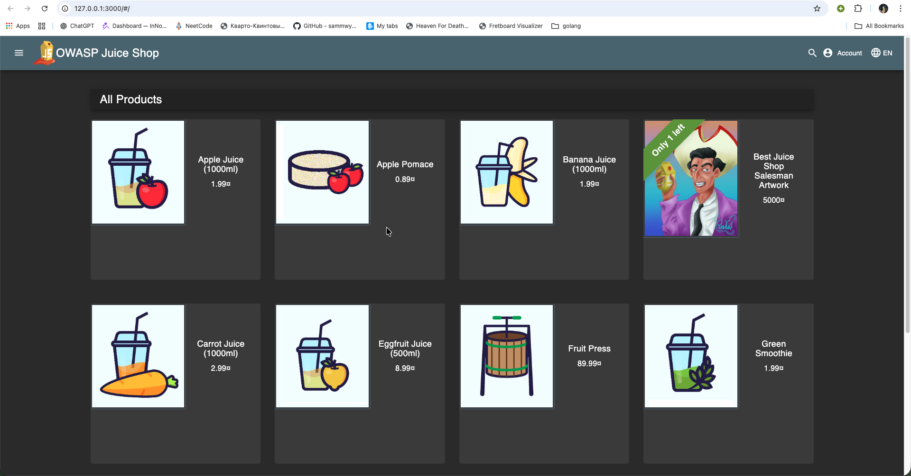

- API check: first 5–10 lines from `curl -s http://127.0.0.1:3000/rest/products | head`

```
<html>
  <head>
    <meta charset='utf-8'> 
    <title>Error: Unexpected path: /rest/products</title>
    <style>* {
  margin: 0;
  padding: 0;
  outline: 0;
}
```

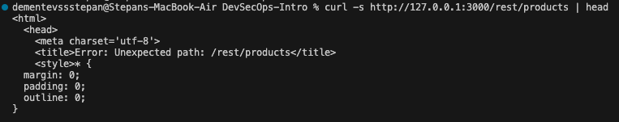


## Surface Snapshot (Triage)
- Login/Registration visible: [V] Yes  [ ] No — notes: Login and sign-up actions are visible from the main navigation and account menu.
- Product listing/search present: [V] Yes  [ ] No — notes: The home page exposes the catalog grid, categories, and a search field for browsing products.
- Admin or account area discoverable: [V] Yes  [ ] No — notes: Account-related pages are reachable from the navbar, and administrative functionality is a known attack surface in Juice Shop.
- Client-side errors in console: [ ] Yes  [V] No — notes: No blocking browser console errors were observed while loading the home page.
- Security headers (quick look — optional): `curl -I http://127.0.0.1:3000` → CSP/HSTS present? - notes: No, there are no `Content-Security-Policy`

## Risks Observed (Top 3)
1) No special security headers, so the app is more vulnerable to attacks like XSS and clickjacking.
2) SQL-injection. We can simply enter the `'` in login and get the exact query used for selecting from `Users` table, which is vulnerable to SQL-injection.
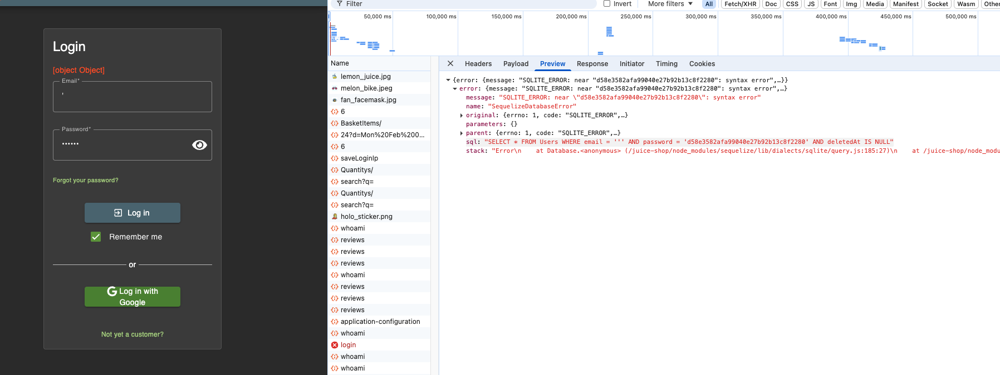
3) Usage of HTTP protocol: Our requests are not encrypted, so they can be intercepted and modified by attackers on an untrusted network.

## PR Template Setup

### Creation Process

- The repository PR template was already configured on the default branch of the fork before opening the lab PR.
- The template contains the required sections: **Goal**, **Changes**, **Testing**, and **Artifacts & Screenshots**.
- The template also includes a short checklist for PR title quality, documentation updates, and secret or temporary file review.

### Verification

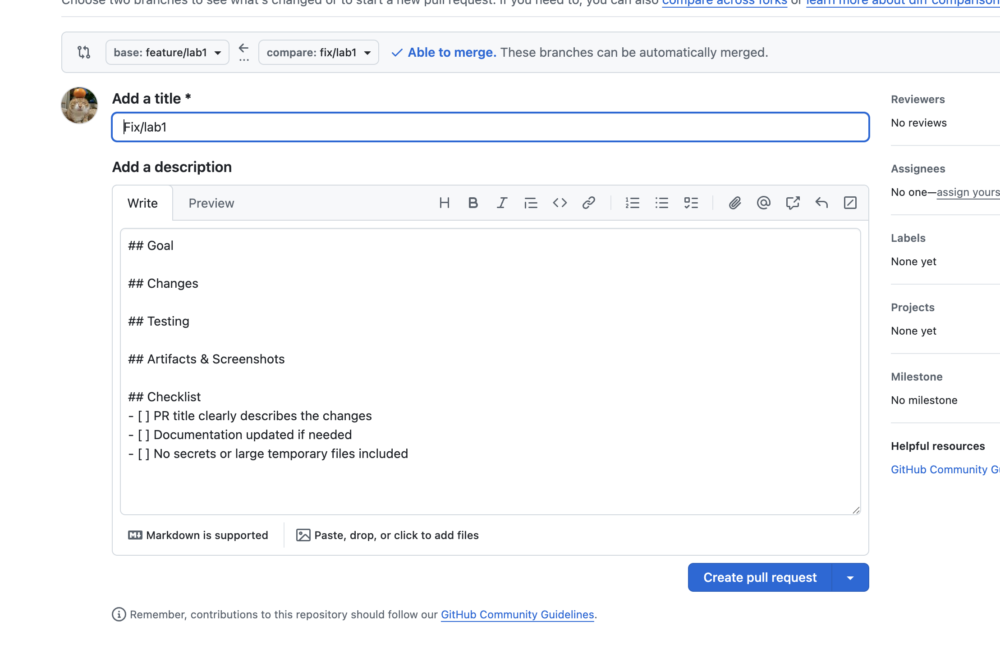

### Why Templates Improve Collaboration

PR templates reduce review friction by making every submission follow the same structure, which helps reviewers quickly find the goal, scope, validation steps, and supporting evidence. They also lower the chance of missing documentation, unclear titles, or accidental inclusion of secrets because the checklist makes those checks explicit before submission.

## Challenges & Solutions

- Challenge: GitHub only applies PR templates from the default branch of the fork.
- Solution: Keep the PR template on the default branch, then open the `feature/lab1` PR so the template auto-populates correctly.

## GitHub Community

Starring repositories helps with open-source discovery and bookmarking, and it also gives maintainers a visible signal that their project is useful to the community. Following developers is useful for team projects and professional growth because it helps track relevant work, learn from others' activity, and stay connected with classmates, TAs, and maintainers.

### Evidence

- Starred the course repository:

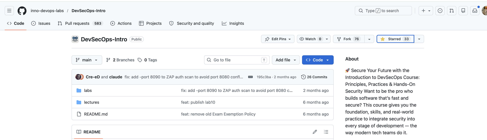

- Starred `simple-container-com/api`:

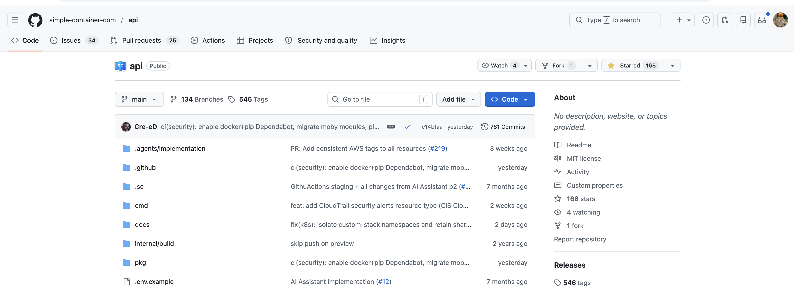

- Followed professor and TAs:

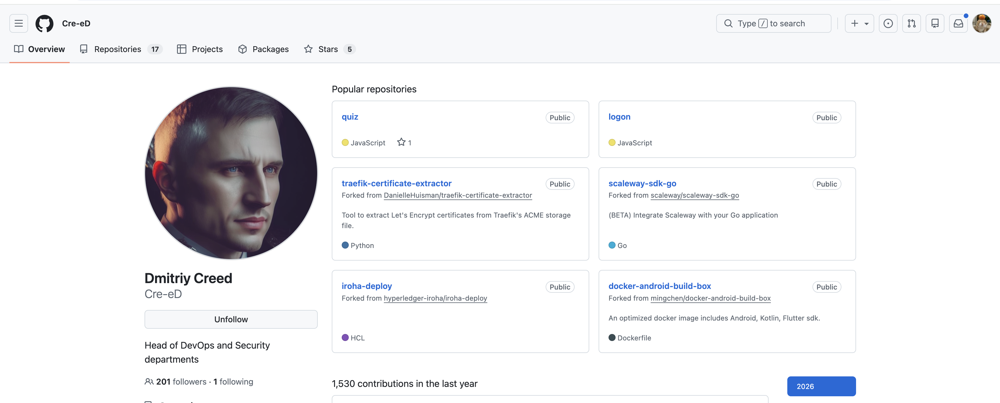

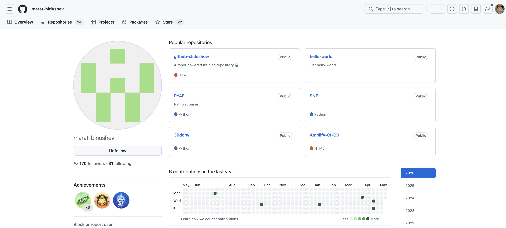

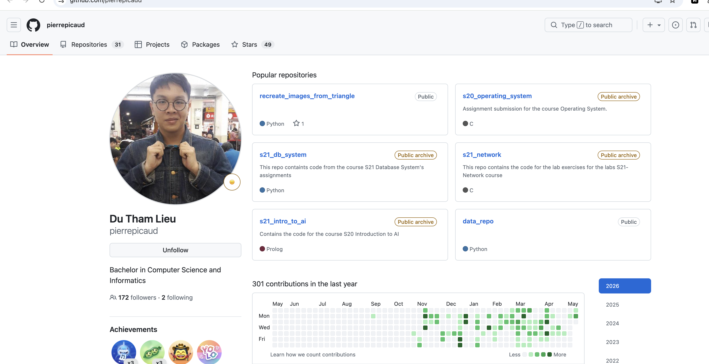

- Followed at least three classmates:

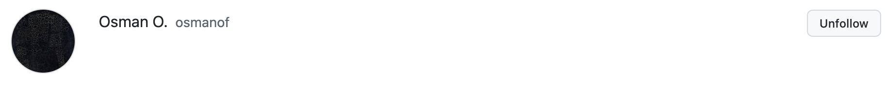

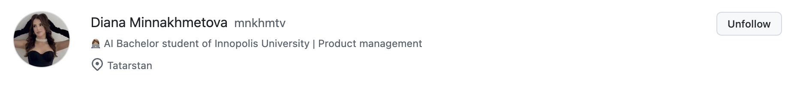

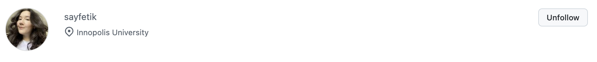