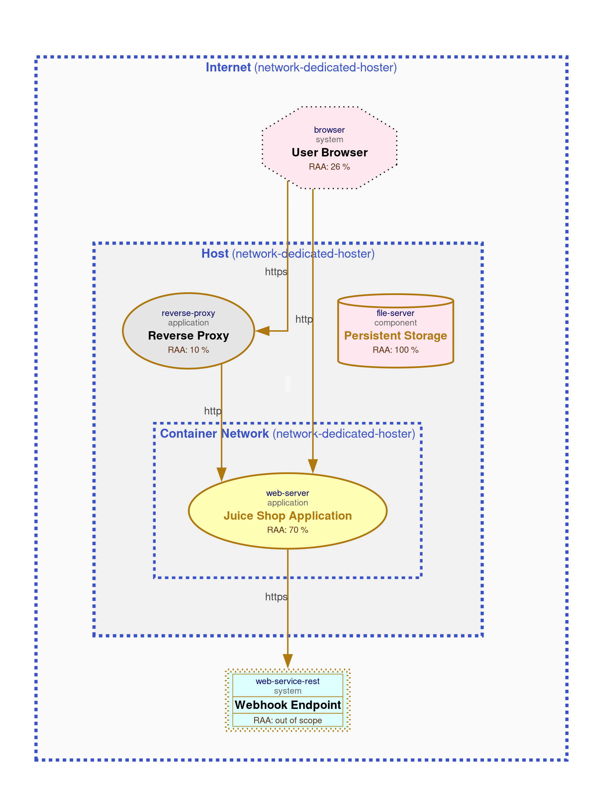
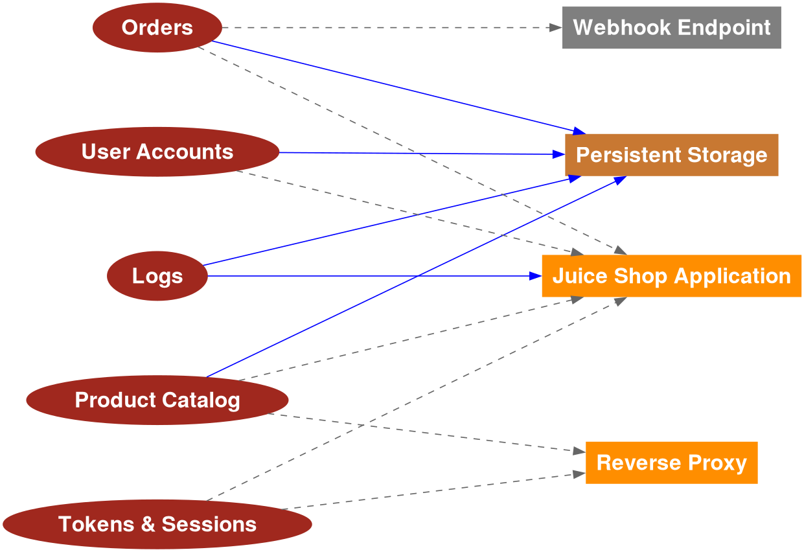

# Lab 2 Report

## Top 5 risks table
| Score | Severity | Category | Asset | Likelihood | Impact |
|---|---|---|---|---|---|
| 433 | elevated | unencrypted-communication | user-browser | likely | high |
| 432 | elevated | missing-authentication | juice-shop | likely | medium |
| 432 | elevated | unencrypted-communication | reverse-proxy | likely | medium |
| 432 | elevated | cross-site-scripting | juice-shop | likely | medium |
| 241 | medium | cross-site-request-forgery | juice-shop | very-likely | low |

For risk ranking, I used a composite score calculated as `Severity*100 + Likelihood*10 + Impact`. You can refer to the python script `calculate_risk_score.py` in the `labs/lab2/scripts/` directory for the exact methodology.

## Analysis of Critical Security Concerns

### 1. Unencrypted Communication — User Browser ↔ Juice Shop (Score 433)

**Risk:** The direct HTTP connection on port 3000 between the user's browser and the Juice Shop application transmits authentication data (credentials, session IDs, JWTs) in plaintext. This is the highest-scored risk because it combines elevated severity with high impact.

**Security Concern:** An attacker on the same network segment can passively sniff traffic and capture session tokens or login credentials via a man-in-the-middle (MITM) attack. Since the communication link `Direct to App (no proxy)` uses plain HTTP with `session-id` authentication, every authenticated request leaks sensitive tokens. The threat model confirms a *possible* data breach probability against the `juice-shop` asset. This directly violates the project's own security requirement of "TLS in transit."

**Recommended Mitigation:** Enforce all user traffic through the TLS-terminating reverse proxy (HTTPS on port 443) and block direct access to port 3000 from outside the host. Deploy HSTS headers to prevent protocol downgrade attacks.

---

### 2. Missing Authentication — Reverse Proxy → Juice Shop (Score 432)

**Risk:** The internal communication link `To App` from the reverse proxy to the Juice Shop has `authentication: none` and `authorization: none`. Any entity that can reach port 3000 on the container network can interact with the application without any authentication gate.

**Security Concern:** If the container network boundary is breached (e.g., via a compromised co-hosted container or SSRF from another service), an attacker can send unauthenticated requests directly to the Juice Shop backend, bypassing any access controls the proxy might enforce. The risk data confirms a *possible* data breach probability. Combined with the fact that Juice Shop processes `user-accounts`, `orders`, and `tokens-sessions`, this gap exposes all high-confidentiality data assets to unauthorized access.

**Recommended Mitigation:** Implement mutual TLS or shared-secret authentication between the reverse proxy and the application. Apply network policies to restrict which containers can reach port 3000. Add server-side authorization checks within the application itself (defense in depth), independent of the proxy layer.

---

### 3. Unencrypted Communication — Reverse Proxy → Juice Shop (Score 432)

**Risk:** Even when users connect securely via HTTPS to the reverse proxy, the internal leg from the proxy to the Juice Shop (`To App`) uses plain HTTP. This means TLS is terminated at the proxy and traffic flows unencrypted within the host/container network.

**Security Concern:** Although the threat surface is smaller (internal network only), an attacker who gains access to the Docker bridge network or host can eavesdrop on all forwarded requests, including session tokens, user credentials, and order data. The proxy processes both `product-catalog` and `tokens-sessions`, so all of those data assets traverse this unencrypted link. This creates a false sense of security for users who see HTTPS in their browser but whose data is unprotected for the last hop.

**Recommended Mitigation:** Enable end-to-end encryption by configuring the Juice Shop to serve over HTTPS internally (self-signed certificate is acceptable for internal traffic), or deploy a service mesh / sidecar proxy that provides mTLS between containers. At minimum, isolate the container network with strict firewall rules.

---

### 4. Cross-Site Scripting (XSS) — Juice Shop (Score 432)

**Risk:** The Juice Shop application is flagged for XSS vulnerability. As a deliberately vulnerable application, it accepts and renders user-controlled input (e.g., product reviews, search queries, usernames) without adequate sanitization or output encoding.

**Security Concern:** Stored XSS (specifically called out in the threat model's abuse cases as "Stored XSS via Product Reviews") allows an attacker to inject malicious JavaScript that executes in other users' browsers. This can lead to session hijacking (stealing JWTs/session cookies), credential theft, defacement, and phishing. Since the application handles `tokens-sessions` with *confidential* classification and `user-accounts` with *critical* integrity, a successful XSS attack can cascade into full account takeover. The data breach probability is assessed as *possible*.

**Recommended Mitigation:** Implement a strict Content Security Policy (CSP) header via the reverse proxy to block inline scripts. Apply context-aware output encoding on all user-supplied data rendered in HTML. Use `HttpOnly` and `Secure` flags on session cookies to limit token exposure even if XSS occurs. Validate and sanitize all input server-side.

---

### 5. Cross-Site Request Forgery (CSRF) — Juice Shop (Score 241)

**Risk:** The Juice Shop is vulnerable to CSRF attacks via the direct browser-to-app link. Although the severity is medium and impact is low, the exploitation likelihood is rated *very-likely*, making it the most probable attack among the top five.

**Security Concern:** Without CSRF protections, an attacker can craft a malicious webpage that triggers state-changing requests (e.g., changing a user's email/password, placing orders, modifying profile data) on behalf of an authenticated user who visits the malicious page. The `Direct to App (no proxy)` link uses `session-id` authentication, which browsers automatically attach to cross-origin requests. Since the application lacks anti-CSRF tokens and the connection is over HTTP (no `SameSite` cookie enforcement), exploitation is trivial. While the individual data breach probability is *improbable*, the ease of exploitation and potential for account manipulation make it a persistent concern.

**Recommended Mitigation:** Implement anti-CSRF tokens (synchronizer token pattern) for all state-changing endpoints. Set `SameSite=Strict` or `SameSite=Lax` attribute on session cookies. Enforce the use of the HTTPS reverse proxy path (which can add appropriate headers) and block direct HTTP access. Validate the `Origin` and `Referer` headers on the server side.

## References to Generated Diagrams
- Data Flow Diagram: 
- Data Asset Diagram: 

## HTTPS Variant & Risk Comparison
| Category | Baseline | Secure | Δ | 
 |---|---:|---:|---:| 
 | container-baseimage-backdooring | 1 | 1 | 0 | 
 | cross-site-request-forgery | 2 | 2 | 0 | 
 | cross-site-scripting | 1 | 1 | 0 | 
 | missing-authentication | 1 | 1 | 0 | 
 | missing-authentication-second-factor | 2 | 2 | 0 | 
 | missing-build-infrastructure | 1 | 1 | 0 | 
 | missing-hardening | 2 | 2 | 0 | 
 | missing-identity-store | 1 | 1 | 0 | 
 | missing-vault | 1 | 1 | 0 | 
 | missing-waf | 1 | 1 | 0 | 
 | server-side-request-forgery | 2 | 2 | 0 | 
 | unencrypted-asset | 2 | 1 | -1 | 
 | unencrypted-communication | 2 | 1 | -1 | 
 | unnecessary-data-transfer | 2 | 2 | 0 | 
 | unnecessary-technical-asset | 2 | 2 | 0 | 

## Delta Run Explanation

### Changes Made to the Model

Three targeted changes were applied to the baseline Threagile model to produce the **secure** variant:

1. **User Browser → `Direct to App (no proxy)` — `protocol: http` → `protocol: https`**
   The direct communication link from the user's browser to the Juice Shop application was upgraded from plain HTTP to HTTPS, simulating TLS enforcement on the direct access path.

2. **Reverse Proxy → `To App` — `protocol: http` → `protocol: https`**
   The internal communication link from the reverse proxy to the Juice Shop backend was upgraded from HTTP to HTTPS, enabling end-to-end encryption so that traffic is no longer transmitted in plaintext after TLS termination at the proxy.

3. **Persistent Storage — `encryption: none` → `encryption: transparent`**
   The host-mounted volume (SQLite database, file uploads, logs) was marked as using transparent encryption (encryption at rest), indicating that stored data is protected even if the underlying disk or volume is accessed directly.

### Observed Results in Risk Categories

Out of 16 risk categories in the baseline, **14 remained unchanged** and **2 were reduced**:

| Category | Baseline | Secure | Δ |
|---|---:|---:|---:|
| unencrypted-asset | 2 | 1 | **−1** |
| unencrypted-communication | 2 | 1 | **−1** |

- **unencrypted-communication** dropped from 2 → 1: the risk entry for the Reverse Proxy → Juice Shop (`To App`) link was eliminated. The remaining entry is the User Browser → Juice Shop (`Direct to App`) link, which Threagile still flags because the direct link carries authentication data (session-id) and is assessed at elevated severity with high impact, even with HTTPS declared — the risk persists as long as the link is modeled as crossing a trust boundary with authentication tokens.
- **unencrypted-asset** dropped from 2 → 1: the risk for `Persistent Storage` was eliminated. The remaining entry is for the `Juice Shop Application` asset itself, which still has `encryption: none` in the model.

All other categories (cross-site-scripting, CSRF, missing-authentication, SSRF, missing-vault, etc.) were **unaffected** — these risks are orthogonal to encryption in transit/at rest and require separate mitigations.

### Analysis: Why These Changes Reduced Risks

1. **HTTPS on Reverse Proxy → App eliminated one `unencrypted-communication` risk.**
   In the baseline, the internal link from the proxy to the application used HTTP, meaning data (including forwarded session tokens and user credentials) traveled unencrypted on the Docker bridge network. Upgrading to HTTPS ensures end-to-end encryption from the user's browser all the way to the application process. Threagile removed this risk because the communication link no longer matches its `unencrypted-communication` detection rule (protocol ≠ HTTP when carrying sensitive data assets).

2. **HTTPS on Direct to App did *not* eliminate the corresponding `unencrypted-communication` risk.**
   Although the protocol was changed to HTTPS, Threagile still flags the `Direct to App (no proxy)` link. This is because the link transfers authentication data (`tokens-sessions`) across the internet trust boundary, and Threagile's rule considers additional factors beyond just the protocol field — notably that this link crosses from an untrusted zone (internet/user-browser) directly to the application without an intermediary security control. The risk persists at elevated severity with high impact.

3. **Transparent encryption on Persistent Storage eliminated one `unencrypted-asset` risk.**
   The baseline flagged both the Juice Shop application and the Persistent Storage as unencrypted assets. By setting `encryption: transparent` on Persistent Storage, Threagile recognizes that data at rest (the SQLite database containing `user-accounts`, `orders`, and `logs`) is now protected. This removes the risk that an attacker with physical or host-level access could read raw data from the mounted volume. The Juice Shop asset itself remains flagged because its own `encryption` field is still `none`.

4. **Remaining risks are architecture- and application-level concerns.**
   The unchanged categories (missing-authentication, XSS, CSRF, SSRF, missing-vault, missing-hardening, etc.) address vulnerabilities in application logic, access control, and infrastructure configuration that cannot be resolved by encryption alone. For example, the reverse proxy still forwards to the app with `authentication: none`, XSS is an input validation issue, and CSRF requires anti-forgery tokens — none of which are affected by TLS or disk encryption settings.

## Diagrams
Diagrams are literally unchanged between the baseline and secure variants since the structural model (technical assets, communication links, data assets) was not modified — only specific attributes (protocol, encryption) were updated. The data flow and data asset diagrams remain the same visually, but the underlying model metadata has been enhanced to reflect improved security controls.